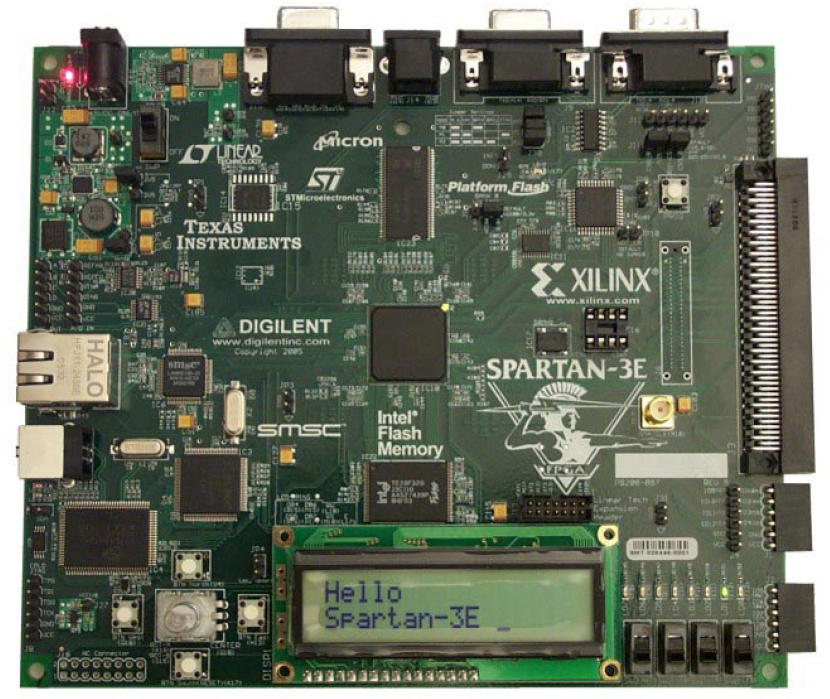

# digital-system-design

- All the designs and codes run in ISE Project Navigator 13.4 32-bit, Xilinx Inc.
- Here contains 16 problems of the homework and 5 special design in Spartan III-E platform. Some detailed tutorials and codes are attached, if you need more detailes and other informations, please contact Chaoqi Yang ycqsjtu@gmail.com or never_say_never@sjtu.edu.cn.

